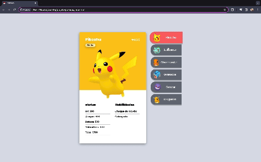
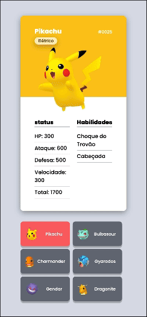

# Projeto Pokedex DevQuest
Olá! Este foi o meu terceiro projeto realizado pelo Curso de Desenvolvimento Web DevQuest, onde estou aprendendo nesta primeira etapa o desenvolvimento frontend, utilizando HTML5 CSS3 e Javascript. Uma das maiores dificuldades que encontrei nesse projeto foi a introdução ao Javascript e dimensionar os cartões da melhor forma para que fiquem harmoniozos e parecendo realemnte com um cartão, já estou tendo algum contato com essas linguagens de programação e num primeiro momento pareceu ser mais complicado do que realmente é, mas fiquei bem feliz com o resultado tanto das interações da página, quanto de sua responsividade em variadas telas, mesmo sendo umas das grandes dificuldade desse exercício para mim.

Por fim, venho dizer que estou gostando muito de aprender desenvolvimento web, responsivo, pois a cada dia mais venho me superando, aprendendo coisas novas, melhorando meu foco para resolução de problemas,pensamento lógico, junto com o olhar critico aos detalhes, o que está fazendo com que eu me apaixone cada dia mais pela profissão e pela área de tecnologia da informação.

## Tecnologias utilizadas
- HTML
- CSS
- JS

## Gifs Mostrando interatividade e responsividade da página

## Dificuldades encontradas
As dificuldades encontradas para a realização desse projeto foram colocar todos os itens de forma ordenada pelo CSS utilizando Display Flex e fazer a interação da página com JS, ja estou melhor familiarizado com as linguagens de programação, mas mesmo assim tinha vezes que colocando o comando para ser realizado na página ele não funcionava, eram nestes momentos que particularmente tinha que parar e repensar no que estava fazendo de errado para a realização satisfatória do responsivo e também para que o modo escuro fique ativo e depois consiga desativar pelo botão animado, com isso obtive uma melhora no meu foco para a resolução de problemas, que com calma e atenção aos detalhes foram solucionados.

 #### Minhas Redes Sociais 📱
 

 
  
   
 

